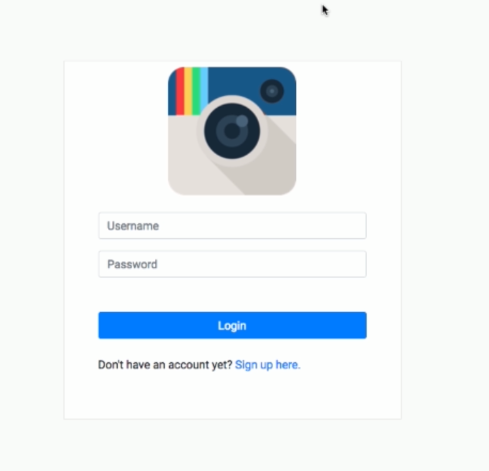

# Proyecto Platzigram Django

[Clase 1 Introducción al curso](#Clase-1-Introducción-al-curso)

[Clase 2 Historia de web development](#Clase-2-Historia-de-web-development)

[]()

[]()

[]()

[]()

[]()

[]()

[]()

[]()

[]()

[]()

[]()

[]()

[]()

[]()

[]()

[]()

[]()

[]()

[]()

[]()

[]()

[]()

[]()

[]()

[]()

[]()

[]()

## Clase 1 Introducción al curso

Los temas que se van a ver en el curso van desde url, vistas y sistemas de templates,  hasta formularios, middleware y vistas basadas en clases.

El proyecto desarrollado será Platzigram y al final se va a realizar deploy en un servidor linux usando una base de datos de Postgresql.

En este proyectose implementara un sistema custom de usuarios, manejando la carga de media por usuario, perfil de usuario, paginacion y crear un middleware para asegurar que todos los perfiles de usuario esten completos durante el uso de la plataforma y manejo de sesiones.



## Clase 2 Historia de web development

Al inicio de la web todos los sitios eran construidos en HTML y solo se veia texto plano conocidos como Text-based. Conforme las necesidades hay ido cambiando la web tambien lo ha hecho.

Eventualmente se requiere hacer conexion con bases de datos y es ahi donde nade CGI Scripts **(Common Gateway Interface)**, el objetivo es que a traves de Request se puedaq ejecutar un Script dentro del servidor. Estos Scripts eran normalmente escritos en perl, python o bash scripting.

Despues de esto se implementa PHP, este lenguaje tiene la capacidad de poder incluir la logica dentro del template pero en algunas ocasiones no se resolvia el problema de estar repitiendo codigo, conexion a base de datos o printar codigo. A partir de esto nacen los **Frameworks**, los cuales resuelven tareas comunes en el desarrollo web como la resolucion a una peticion HTTP, creacion de una respuesta, conexion a base de datos, consulta a tablas, interaccion con HTML con interfaces mas complejas y cada Framework tiene alguna funcionalidad especifica. **por ejemplo** Ruby on rails que agrega los generadores, Django agrega el admin o sistema de usuarios.

Django nace en 2004 para crear y mantener sitios muy grandes, URLs bien diseñadas, tener objetos Http Request y Response para cada peticion, cubrir la necesidad de crear sitios web en poco tiempo y generar un ORM, es decir que te permite conectarte a la base de datos a traves del framework. Django se toma la seguridad de las aplicaciones con mucha seriedad. Django es un framework muy escalable. Django es muy versatil, ha sido usado para todo tipo de proyectos, desde redes sociales hasta proyectos cientificos.

**Caracteristicas**

- Rapido desarrollo 

- Viene listo para todo, es decir que trae consigo muchas herramientas como la autenticacion de usuarios, la administracion de contenido, mapas de sitio, etc.

- Seguro

- Escalable

- Versatil

- Django es open source.

- Django tiene el concepto **(DRY(Don't Repeat Yourself))**, donde dice que si estas copiando y pegando algo en tu codigo, seguramente estas haciendo algo mal

## Clase 3 Preparación del entorno de trabajo en Windows y Linux

**Instalación de Python en Windows**

___

1. Dirigirse a https://python.org

2. Ir a la sección de descargas

3. Descargar cualquier versión superior a 3.6.*

**Instalación de Python en Linux**
___

1. Correr:
```
sudo add-apt-repository -y ppa:jonathonf/python-3
sudo apt-get update -y
sudo apt-get install -y python3
sudo apt-get install -y python3-dev
sudo apt-get install -y python3-distutils
sudo apt-get install python3-pip
sudo apt-get install python3-venv
sudo apt install python3-virtualenv

```

## Verificación de la descarga

1. Correr `python3 --version`

2. Correr `pip3 --version`

## Entorno virtual

1. Correr `python3 -m venv env` donde `env` sea el nombre deseado

2. Correr `source env/bin/activate` para activar el entorno

3. Correr `deactivate` para desactivar el entorno

## Instalación de django

1. Activar entorno virtual

2. Correr `pip install django -U`
