# Proyecto Platzigram Django

[Clase 1 Introducción al curso](#Clase-1-Introducción-al-curso)

[Clase 2 Historia de web development](#Clase-2-Historia-de-web-development)

[Clase 3 Preparación del entorno de trabajo en Windows y Linux](#Clase-3-Preparación-del-entorno-de-trabajo-en-Windows-y-Linux)

[Clase 4 Creación del proyecto Platzigram / Tu primer Hola, mundo! en Django](#Clase-4-Creación-del-proyecto-Platzigram-/-Tu-primer-Hola-mundo-en-Django)

[Clase 5 El objeto Request](#Clase-5-El-objeto-Request)

[Clase 6 Solución al reto - Pasando argumentos en la URL](#Clase-6-Solución-al-reto-Pasando-argumentos-en-la-URL)

[Clase 7 Creación de la primera app](#Clase-7-Creación-de-la-primera-app)

[Clase 8 Introducción al template system](#Clase-8-Introducción-al-template-system)

[Clase 9 Patrones de diseño y Django](#Clase-9-Patrones-de-diseño-y-Django)

[Clase 10 La M en el MTV(model, Template, View)](#Clase-10-La-M-en-el-MTV(model-Template-View))

[Clase 11 El ORM de Django](#Clase-11-El-ORM-de-Django)

[Clase 12 Glosario](#Clase-12-Glosario)

[Clase 13 Extendiendo el modelo de usuario](#Clase-13-Extendiendo-el-modelo-de-usuario)

[Clase 14 Implementación del modelo de usuarios de Platzigram](#Clase-14-Implementación-del-modelo-de-usuarios-de-Platzigram)

[Clase 15 Explorando el dashboard de administración](#Clase-15-Explorando-el-dashboard-de-administración)

[Clase 16 Dashboard de Administración](#Clase-16-Dashboard-de-Administración)

[Clase 17 Creación del modelo de posts](#Clase-17-Creación-del-modelo-de-posts)

[Clase 18 Templates y archivos estáticos](#Clase-18-Templates-y-archivos-estáticos)

[]()

[]()

[]()

[]()

[]()

[]()

[]()

[]()

[]()

[]()

[]()

## Clase 1 Introducción al curso

Los temas que se van a ver en el curso van desde url, vistas y sistemas de templates,  hasta formularios, middleware y vistas basadas en clases.

El proyecto desarrollado será Platzigram y al final se va a realizar deploy en un servidor linux usando una base de datos de Postgresql.

En este proyectose implementara un sistema custom de usuarios, manejando la carga de media por usuario, perfil de usuario, paginacion y crear un middleware para asegurar que todos los perfiles de usuario esten completos durante el uso de la plataforma y manejo de sesiones.


## Clase 2 Historia de web development

Al inicio de la web todos los sitios eran construidos en HTML y solo se veia texto plano conocidos como Text-based. Conforme las necesidades hay ido cambiando la web tambien lo ha hecho.

Eventualmente se requiere hacer conexion con bases de datos y es ahi donde nade CGI Scripts **(Common Gateway Interface)**, el objetivo es que a traves de Request se puedaq ejecutar un Script dentro del servidor. Estos Scripts eran normalmente escritos en perl, python o bash scripting.

Despues de esto se implementa PHP, este lenguaje tiene la capacidad de poder incluir la logica dentro del template pero en algunas ocasiones no se resolvia el problema de estar repitiendo codigo, conexion a base de datos o printar codigo. A partir de esto nacen los **Frameworks**, los cuales resuelven tareas comunes en el desarrollo web como la resolucion a una peticion HTTP, creacion de una respuesta, conexion a base de datos, consulta a tablas, interaccion con HTML con interfaces mas complejas y cada Framework tiene alguna funcionalidad especifica. **por ejemplo** Ruby on rails que agrega los generadores, Django agrega el admin o sistema de usuarios.

Django nace en 2004 para crear y mantener sitios muy grandes, URLs bien diseñadas, tener objetos Http Request y Response para cada peticion, cubrir la necesidad de crear sitios web en poco tiempo y generar un ORM, es decir que te permite conectarte a la base de datos a traves del framework. Django se toma la seguridad de las aplicaciones con mucha seriedad. Django es un framework muy escalable. Django es muy versatil, ha sido usado para todo tipo de proyectos, desde redes sociales hasta proyectos cientificos.

**Caracteristicas**

- Rapido desarrollo 

- Viene listo para todo, es decir que trae consigo muchas herramientas como la autenticacion de usuarios, la administracion de contenido, mapas de sitio, etc.

- Seguro

- Escalable

- Versatil

- Django es open source.

- Django tiene el concepto **(DRY(Don't Repeat Yourself))**, donde dice que si estas copiando y pegando algo en tu codigo, seguramente estas haciendo algo mal

## Clase 3 Preparación del entorno de trabajo en Windows y Linux

**Instalación de Python en Windows**

___

1. Dirigirse a https://python.org

2. Ir a la sección de descargas

3. Descargar cualquier versión superior a 3.6.*

**Instalación de Python en Linux**
___

1. Correr:
```
sudo add-apt-repository -y ppa:jonathonf/python-3
sudo apt-get update -y
sudo apt-get install -y python3
sudo apt-get install -y python3-dev
sudo apt-get install -y python3-distutils
sudo apt-get install python3-pip
sudo apt-get install python3-venv
sudo apt install python3-virtualenv

```

## Verificación de la descarga

1. Correr `python3 --version`

2. Correr `pip3 --version`

## Entorno virtual

1. Correr `python3 -m venv env` donde `env` sea el nombre deseado

2. Correr `source env/bin/activate` para activar el entorno

3. Correr `deactivate` para desactivar el entorno

## Instalación de django

1. Activar entorno virtual

2. Correr `pip install django -U`

## Clase 4 Creación del proyecto Platzigram / Tu primer Hola, mundo! en Django

En la terminal con el ambiente virtual prendido ejecutar

`pip freeze` --> para validar las extensiones instaladas.

En mi caso al ejecutar el comando aparece lo siguiente 

```
asgiref==3.2.10
Django==3.1.2
pytz==2020.1
sqlparse==0.4.1
```

Ahora en la consola ejecutar 

`django-admin` --> Es una interfaz de Django que permite correr otros subcomandos

En la terminal ejecutar ahora 

`django-admin startproject platzigram .` --> para la creación del proyecto.

el punto al final es para indicar que el folder **platzigram** se cree dentro del mismo directorio

Dentro de la carpeta platzigram hay varios archivos creados, el primero de ellos es **__init__.py**, el cual el objetivo de ese archivo es declarar platzigram como un modulo de Python.

El siguiente archivo se llama **settings**, el cual define todas las configuraciones del proyecto.

El siguiente archivo es **urls**, el cual es el archivo principal, donde esta el punto de entrada para todas peticiones que lleguen al proyecto de Django, la manera en que funciona es que va a tratar de buscar la url requerida y va a tratar de encontrarla con su vista correspondiente.

El siguiente archivo es **wsgi** el cual es el archivo usado durante el deploymen para produccion y es la interfaz wsgi con el proyecto Django cuando el servidor esta corriendo en produccion.

El siguiente archivo es **manage**. este es un archivo que nunca se va a tocar pero se convierte en el archivo con el cual se interactua durante todo el desarrollo

en el archivo **settings** encontramos la siguiente estructura de codigo

`BASE_DIR = Path(__file__).resolve().parent.parent` -> Esta es la linea mas importante porque es la que declara el lugar donde esta corriendo el proyecto

`SECRET_KEY = '%o(+74&#qc6#$@1ozm-6d(zim!t6+ai34e+d=5@v9n=zz7kwl&'` -> Este es usado para el hash de las contraseñas y der las sesiones que se almacenan en la base de datos 

`DEBUG = True` -> Marca que el proyecto esta en desarrollo en debugging, cuando el proyecto sea liberado a produccion es importante que la variable pase a `False`

`ALLOWED_HOSTS = []` -> Esta variable se utiliza hasta cuando se hace deploy pero basicamente lo que dice es que host esta permitido usar en el proyecto.

```
INSTALLED_APPS = [
    'django.contrib.admin',
    'django.contrib.auth',
    'django.contrib.contenttypes',
    'django.contrib.sessions',
    'django.contrib.messages',
    'django.contrib.staticfiles',
]

MIDDLEWARE = [
    'django.middleware.security.SecurityMiddleware',
    'django.contrib.sessions.middleware.SessionMiddleware',
    'django.middleware.common.CommonMiddleware',
    'django.middleware.csrf.CsrfViewMiddleware',
    'django.contrib.auth.middleware.AuthenticationMiddleware',
    'django.contrib.messages.middleware.MessageMiddleware',
    'django.middleware.clickjacking.XFrameOptionsMiddleware',
]
``` 
Son las aplicaciones instaladas ligadas al proyecto que estamos creando agrega la aplicacion de administrador, autenticacion, contenttypes es el encargado de hacer conexion con la base de datos, sesiones, mensajes, manejos estaticos y lo mismo con el siguiente que es MIDDLEWARE.

`ROOT_URLCONF = 'platzigram.urls'` -> Definimos cual es nuestro archivo principal o modulo de entradas de urls

Despues viene la configuracion de TEMPLATES

```
TEMPLATES = [
    {
        'BACKEND': 'django.template.backends.django.DjangoTemplates',
        'DIRS': [],
        'APP_DIRS': True,
        'OPTIONS': {
            'context_processors': [
                'django.template.context_processors.debug',
                'django.template.context_processors.request',
                'django.contrib.auth.context_processors.auth',
                'django.contrib.messages.context_processors.messages',
            ],
        },
    },
]
```

`WSGI_APPLICATION = 'platzigram.wsgi.application'` -> Cual es el archivo de entrada que por default es el que creo el comando startproject

A continuacion viene la configuracion de la base de datos que por default viene condfigurado con sqlite3 pero es muy facil poner cualquier tipo de base de datos como Postgresql, oracle o Mysql.

sqlite3 es solo para realizar pruebas no debe usarse en produccion

```
DATABASES = {
    'default': {
        'ENGINE': 'django.db.backends.sqlite3',
        'NAME': BASE_DIR / 'db.sqlite3',
    }
}
```

Tambien agrega validadores de contraseñas donde si esta usando el sistema de autenticacion todas las contraseñas pasen por validaciones

```
AUTH_PASSWORD_VALIDATORS = [
    {
        'NAME': 'django.contrib.auth.password_validation.UserAttributeSimilarityValidator',
    },
    {
        'NAME': 'django.contrib.auth.password_validation.MinimumLengthValidator',
    },
    {
        'NAME': 'django.contrib.auth.password_validation.CommonPasswordValidator',
    },
    {
        'NAME': 'django.contrib.auth.password_validation.NumericPasswordValidator',
    },
]
```

`LANGUAGE_CODE = 'en-us'`-> Aca se define cual es el lenguaje en el que se esta interactuando con la aplicacion, por default viene en ingles 

`TIME_ZONE = 'UTC'` -> Es la zona horaria en la que esta corriendo la aplicacion

y las siguientes son variables utilizadas para traduccion 

`USE_I18N = True`

`USE_L10N = True`

`USE_TZ = True`

`STATIC_URL = '/static/'`-> Define que cada que se vaya a /static/ en lugar de buscar la url usando el archivo urls.py, va a buscar resolver el archivo estatico que se esta pidiendo.

Por ultimo esta el archivo **manage.py** que no se va a leer pero si interactuar con el

para esto se en la terminal debemos ejecutar 

`python3 manage.py`

y vemos que el despliega una lista similar al de django donde estan los comandos de [auth], [contenttypes], [django], [sessions] y [staticfiles]

```
Type 'manage.py help <subcommand>' for help on a specific subcommand.

Available subcommands:

[auth]
    changepassword
    createsuperuser

[contenttypes]
    remove_stale_contenttypes

[django]
    check
    compilemessages
    createcachetable
    dbshell
    diffsettings
    dumpdata
    flush
    inspectdb
    loaddata
    makemessages
    makemigrations
    migrate
    sendtestemail
    shell
    showmigrations
    sqlflush
    sqlmigrate
    sqlsequencereset
    squashmigrations
    startapp
    startproject
    test
    testserver

[sessions]
    clearsessions

[staticfiles]
    collectstatic
    findstatic
    runserver
```
El que mas interesa en este momento particularmente es runserver y se inicia en la terminal con la siguiente sentencia

`python3 manage.py runserver`

Despues de correr este comando nos despliega esta informacion 

```
Watching for file changes with StatReloader
Performing system checks...

System check identified no issues (0 silenced).

You have 18 unapplied migration(s). Your project may not work properly until you apply the migrations for app(s): admin, auth, contenttypes, sessions.
Run 'python manage.py migrate' to apply them.
October 09, 2020 - 15:41:57
Django version 3.1.2, using settings 'platzigram.settings'
Starting development server at http://127.0.0.1:8000/
Quit the server with CONTROL-C.
```

Donde Starting developmetindica que esta la ruta en el navegador que esta funcionando con django


Para construir el primer hola mundo de la aplicacion nos dirigimos a **urls.py** , es posible comentar todo para ir revisando la documentacion y que siginifica cada cosa y por el momento no se requiere la vista  admin por tanto se deja comentada, `path('admin/', admin.site.urls),` , el `path()` como funciona es que se define la url a la que se esta esperando responder algo y es el primer argunmento de la funcion que en este caso seria `'hello-world'` lo cual significa que cuando vayamos a http://127.0.0.1:8000/hello-world algo tiene que pasar, y ese algo es el segun argunmento de la funcion path el cual es la vista que se va a generar para eso se puede definir una funcion o una clase, en este caso se va a crear la funcion `def hello_world(request):` siempre todas las vistas reciben un request que es el objeto del request y lo que regresa es una respuesta.

Para escribir una respuesta http debemos importar una herramienta de django llamada httpResponse `from django.http import HttpResponse`.

Despues de esto se regresa una instancia de esa clase con el contenido que nosotros queramos establecer en este caso `'Hello, world!'`

**urls.py**

```
"""platzigram URL Configuration

The `urlpatterns` list routes URLs to views. For more information please see:
    https://docs.djangoproject.com/en/3.1/topics/http/urls/
Examples:
Function views
    1. Add an import:  from my_app import views
    2. Add a URL to urlpatterns:  path('', views.home, name='home')
Class-based views
    1. Add an import:  from other_app.views import Home
    2. Add a URL to urlpatterns:  path('', Home.as_view(), name='home')
Including another URLconf
    1. Import the include() function: from django.urls import include, path
    2. Add a URL to urlpatterns:  path('blog/', include('blog.urls'))
"""
""" from django.contrib import admin
from django.urls import path

urlpatterns = [
    path('admin/', admin.site.urls),
]
 """
from django.urls import path
from django.http import HttpResponse


def hello_world(request):
    return HttpResponse('Hello, world!')


urlpatterns = [

    path('hello-world', hello_world)

    
]
```

Ahora en el navegado pordemos ir a la direccion http://127.0.0.1:8000/hello-world y desplegar el primer hola mundo 


## Clase 5 El objeto Request

En esta clase crearemos mas vistas, jugaremos con los diferentes patrones de urls que django nos permite tener, revisaremos cómo django procesa las peticiones.

Lo primero que hay que hacer es revisar la documentacion de [django](https://docs.djangoproject.com/en/3.1/topics/http/urls/), para revisar como funciona el **dispatcher** de urls. la documentacion se encuentra en ingles pero hay un paso a paso que indica como procesa sjango una solicitud

**Cómo procesa Django una solicitud**

Cuando un usuario solicita una página de su sitio con tecnología Django, este es el algoritmo que sigue el sistema para determinar qué código Python ejecutar:

1. Django determina el módulo raíz URLconf que se utilizará. Por lo general, este es el valor de la **ROOT_URLCONF** configuración, pero si el **HttpRequest** objeto entrante tiene un **urlconf** atributo (establecido por middleware), su valor se utilizará en lugar de la **ROOT_URLCONF** configuración que se encuentra en settings.

2. Django carga ese módulo de Python y busca la variable **urlpatterns**. Esta debería ser una lista de Python **django.urls.path()** y / o **django.urls.re_path()** instancias.

3. Django recorre cada patrón de URL, en orden, y se detiene en el primero que coincide con la URL solicitada.

4. Una vez que uno de los patrones de URL coincide, Django importa y llama a la vista dada, que es una función de Python simple (o una vista basada en clases ). La vista recibe los siguientes argumentos:

- Una instancia de **HttpRequest**.

- Si el patrón de URL coincidente no devolvió ningún grupo con nombre, las coincidencias de la expresión regular se proporcionan como argumentos posicionales.

- Los argumentos de la palabra clave se componen de cualquier parte nombrada que coincida con la expresión de la ruta, anulada por cualquier argumento especificado en el **kwargs** argumento opcional para **django.urls.path()** o **django.urls.re_path().**

5. Si ningún patrón de URL coincide, o si se genera una excepción durante cualquier punto de este proceso, Django invoca una vista de manejo de errores adecuada. Consulte Manejo de errores a continuación.

Ahora lo que se va a hacer es crear un archivo para manejar las vistas dentro de la carpeta platzigram que se va a llamar **views.py** y alli se va a agregar la vista que habiamos creado en la clase anterior y la quitamos de urls.py

```
""" Platzigram views """

from django.http import HttpResponse


def hello_world(request):
    """ Return a greeting """
    return HttpResponse('Hello, world!')
```

y ahora importarla en **urls.py** para que siga funcionando la vista

```
from django.urls import path

from platzigram import views


urlpatterns = [

    path('hello-world/', views.hello_world)


]
```

por el momento nada ha cambiado y la vista que habiamos visto antes en http://127.0.0.1:8000/hello-world sigue cargando como lo hizo anteriormente


Ahora en el archivo **views** utilizamos un modulo que se va a requerir para utilizar la hora del servidor que se llama datetime que realmente es una utilidad de Python `from datetime import datetime`, cambiamos el `Hello, world!` y le pasamos otro argumento con la ahora actual para verla en el navegador

```
""" Platzigram views """

# Django
from django.http import HttpResponse

# utilities
from datetime import datetime

def hello_world(request):
    """ Return a greeting """
    now = datetime.now()
    return HttpResponse('Oh, hi! current time is {now}'.format(now=str(now)))
```


para mejorar la vista del formato de la hora se puede agregar a la variable now lo siguiente `now = datetime.now().strftime('%b %dth, %Y - %H:%M hrs')` donde `%b` indica el mes `%dth,` es dia `%Y` es el año `%H:%M hrs` indica la hora y minutos y al pasar el formato ya no es necesario convertirlo a un string por tanto la respuesta queda asi `return HttpResponse('Oh, hi! current time is {now}'.format(now=now))` o la otra forma para escribirlo seria la siguiente

```
""" Platzigram views """

# Django
from django.http import HttpResponse

# utilities
from datetime import datetime

def hello_world(request):
    """ Return a greeting """
    return HttpResponse('Oh, hi! current time is {now}'.format(
        now= datetime.now().strftime('%b %dth, %Y - %H:%M hrs')
        ))
```


Hasta el momento no se ha hecho nada con el objeto request por tanto se va a crear otra vista despues de hello_world para ver que sucede con el objeto

```
def hi(request):
    """ Hi """
    return HttpResponse('Hi!')
```

y ahora se debe ligar a una url en el archivo **urls.py**

```
from django.urls import path

from platzigram import views


urlpatterns = [

    path('hello-world/', views.hello_world),
    path('hi/', views.hi)

]
```


Para ver que esta pasando con request simplemente podemos hacer la impresion de este objeto con `print(request)`

```
def hi(request):
    """ Hi """
    print(request)
    return HttpResponse('Hi!')
```
Donde esta imprimiendo el objeto es en la terminal que indica que es un objeto de WSGIRequest que es un metodo GET y la url

`<WSGIRequest: GET '/hi/'>`

los atributos del objeto **HttpRequest** los encuentras [aqui](https://docs.djangoproject.com/en/3.1/ref/request-response/#django.http.HttpRequest)

la desventaja de la funcion `print()` es que se tiene que usar una y otra vez donde se quiera ver que esta pasando con el objeto. Existe una utilidad de Python que se llama **pdb** el cual es un debugger de Python que se llama asi `import pdb; pdb.set_trace()` el **;** es para no utilizar otra linea, esto se reemplaza en la funcion `print(request)`

para usarlo debemos recarga la direccion http://127.0.0.1:8000/hi/, esta se va a quedar cargando y luego en la terminal podemos hacer uso de pdb


y asi es como podemos tener acceso a todos los metodos de request


para salir de este debug podemos presionar la tecla **c + Enter** en la terminal y para finalizar o detener el servidor con **ctrl + c**

ahora en la funcion vamos a pasar una lista de numeros de la siguiente forma

```
def hi(request):
    """ Hi """
    numbers = request.GET['numbers']
    return HttpResponse(str(numbers))
 ```

 y en el navegador pasamos lo siguiente http://127.0.0.1:8000/hi/?numbers=10,4,50,32 , lo cual va a traer esa lista de numeros en el navegador

**Reto de la clase:** Crea una vista y su respectiva URL en la que recibas números y hagas operaciones con ellos. En la siguiente clase te voy a enseñar a resolverlo.

Regresa la lista ordenada de números en formato json.

## Clase 6 Solución al reto - Pasando argumentos en la URL

Continuando con las clases a continuacion se va a solucionar el reto de la clase pasada y ver otras formas de pasar argumentos a traves de las urls

para esto agregamos un debug ha la funcion `hi`

```
def hi(request):
    """ Hi """
    numbers = request.GET['numbers']
    import pdb; pdb.set_trace()
    return HttpResponse(str(numbers))
```

despues de esto utilizamos la terminal para regresar a `numbers` lo cual en un principio no trae una lista de numeros


pero se puede agregar un metodo para poder separar los numeros dado un caracter, el cual se llama split y lo que recibe es el caracter que lo separa que en este caso es una coma , y si hacemos split obtenemos una lista de numeros pero estos numeros realmente siguen como enteros 


Usando un for se puede recorrer cada uno de los caracteres y convertirlos en enteros mediante un list comprehension (Pdb) `[int(i) for i in numbers.split(',')]` esto va a regresar una lista de numeros 

`[10, 4, 50, 32]`

modificando nuestro codigo de la funcion hi quedaria de la siguiente forma

```
def hi(request):
    """ Hi """
    numbers = [int(i) for i in request.GET['numbers'].split(',')]
    sorted_ints = sorted(numbers)
    return HttpResponse(str(numbers), content_type='application/json')
```    

Esto nos regresara en el navegador la lista que ya conocemos 

`[10, 4, 50, 32]`

revisando la documentacion sobre [HttpResponse Objects](https://docs.djangoproject.com/en/3.1/ref/request-response/#httpresponse-objects)

podemos encontrar el uso de content_type

**HttpResponse objetos** 

**clase HttpResponse**

A diferencia de los **HttpRequest** objects, que son creados automáticamente por Django, los **HttpResponse** objects son tu responsabilidad. Cada vista que escriba es responsable de crear instancias, completar y devolver un **HttpResponse**.

La **HttpResponse** class vive en el **django.http** module.

**Uso**

**Pasando cadenas**

El uso típico es pasar el contenido de la página, como una cadena, una cadena de bytes o memoryview, al HttpResponseconstructor:

```
>>> from django.http import HttpResponse
>>> response = HttpResponse("Here's the text of the Web page.")
>>> response = HttpResponse("Text only, please.", content_type="text/plain")
>>> response = HttpResponse(b'Bytestrings are also accepted.')
>>> response = HttpResponse(memoryview(b'Memoryview as well.'))
```
___

Modificando nuevamente nuestra funcion para regresarla como un objeto json podemos declarar en un diccionario e importar la libreria json para hacer uso de esta, tambien existe otra forma de implementarla a traves de [JsonResponse objects](https://docs.djangoproject.com/en/3.1/ref/request-response/#httpresponse-objects)

```
""" Platzigram views """

# Django
from django.http import HttpResponse

# utilities
from datetime import datetime
import json

def hello_world(request):
    """ Return a greeting """
    return HttpResponse('Oh, hi! current time is {now}'.format(
        now= datetime.now().strftime('%b %dth, %Y - %H:%M hrs')
        ))


def hi(request):
    """ Hi """
    numbers = [int(i) for i in request.GET['numbers'].split(',')]
    sorted_ints = sorted(numbers)
    data = {
        'status': 'ok',
        'numbers': sorted_ints,
        'message': 'Integers sorted successfuly.'
    }
    return HttpResponse(json.dumps(data), content_type='application/json')
```

esto en nuestro navegador nos va a regresar lo siguiente

`{"status": "ok", "numbers": [4, 10, 32, 50], "message": "Integers sorted successfuly."}`

y si queremos agregar indentacion para que se vea mas presentable podemos utilizarlo como parametros en dumps

`return HttpResponse(json.dumps(data, indent=4), content_type='application/json')`

para que el navegador lo suba de la siguiente forma 

```
{
    "status": "ok",
    "numbers": [
        4,
        10,
        32,
        50
    ],
    "message": "Integers sorted successfuly."
}
```

Hasta aqui estaria resuelto el resto de la clase anterior, ahora lo que sigue es resolver otra manera para pasar argumentos. 

En los sitios web podemos ver cosas como `http://127.0.0.1:8000/users/jeyfred` o un blog post algo como esto `http://127.0.0.1:8000/post/2020`

para que django pueda realizar este tipo de cosas utiliza [Path converters](https://docs.djangoproject.com/en/3.1/topics/http/urls/).

y en la documentacion se indica que puede ser una lista de paths `django.urls.path()` o una lista de repaths ` django.urls.re_path()`.

Un ejemplo seria una validacion de edad indicando que Platzigram no puede ser usado por menores de 15 años, para eso dentro del archivo de **urls.py** creamos la ruta 


from django.urls import path

from platzigram import views

```
urlpatterns = [

    path('hello-world/', views.hello_world),
    path('sorted/', views.sort_integers),
    path('hi/<str:name>/<int:age>/', views.say_hi)
]
```

**Nota:** hay un pequeño cambio en la funcion **hi**, cambia por sort_integers por tanto en la url se vera diferente.

y ahora dentro de las vistas en **views.py** implementamos la funcion `say_hi`, la documentacion indica que si en el path se pasa las variables name y age en este caso de ejemplo `path('hi/<str:name>/<int:age>/', views.say_hi`, la funcion esta obligada a pasar estos parametros `def say_hi(request, name, age):`

```
""" Platzigram views """

# Django
from django.http import HttpResponse

# utilities
from datetime import datetime
import json

def hello_world(request):
    """ Return a greeting """
    return HttpResponse('Oh, hi! current time is {now}'.format(
        now= datetime.now().strftime('%b %dth, %Y - %H:%M hrs')
        ))


def sort_integers(request):
    """ Returna JSON response with sorted integers. """
    numbers = [int(i) for i in request.GET['numbers'].split(',')]
    sorted_ints = sorted(numbers)
    data = {
        'status': 'ok',
        'numbers': sorted_ints,
        'message': 'Integers sorted successfuly.'
    }
    return HttpResponse(json.dumps(data, indent=4), content_type='application/json')


def say_hi(request, name, age):
    """ Return a greeting """
    if age < 12:
        message = 'Sorry {}, you are not allowed here'.format(name)
    else:
        message = 'Hello, {}! Welcome to Platzigram'.format(name) 
    return HttpResponse(message)
```

Si vamos al navegador y pasamos http://127.0.0.1:8000/hi/jeyfred/11/ 


y ahora si pasamos en el navegador otro argumento http://127.0.0.1:8000/hi/jeyfred/26/

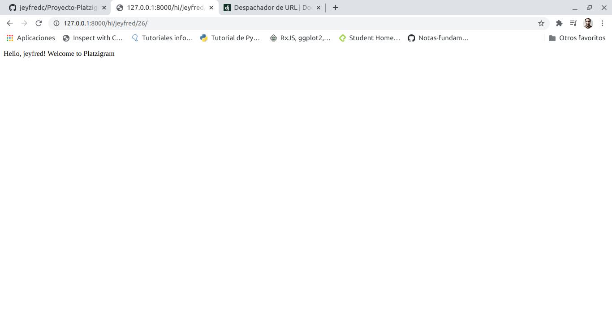

## Clase 7 Creación de la primera app

Vamos a explorar el concepto de Apps en Django y crearemos nuestra primera app de Platzigram, que es la aplicacion de **posts** y tambien los archivos de apps, admin, views, models y  tests.

La manera de crear una aplicacion dentro Django es utilizar el archivo **Manage.py** para inciarlo debemos ejecutar en la terminal lo siguiente

`python3 manage.py startapp posts`

Es importante destacar que las aplicaciones vengan en plural por convencion. 

Una app dentro de Django es un modulo de python que provee un conjunto de funcionalidades relacionadas entre sí.

Las apps son una combinación de models, vistas, urls, archivos estaticos.

Muchas apps en django estan hechas para ser reutilizadas.

esta es la manera como se ven los nuevos archivos despues de haber ejecutado startapp dentro de la terminal donde vemos una carpeta que se llama **migrations** que es la encarga de guardar los cambios en la base de datos.

El archivo **admin.py**, el cual se encarga de administrar los modelos.

El archivo **apps.py**, el cual declara toda la configuracion de la app hacia el publico en caso de que la app sea reutilizable.

El archivo **models.py**, el cual sirve para definir los modelos de nuestros datos.

El archivo **tests.py**, el cual se usa para pruebas.

y un archivo **views.py** que sirve para hacer render de las vistas 


Para instalar la aplicacion es necesario realizar la configuracion en el archivo **apps.py**, podemos hacer uso de la documentacion de [applications](https://docs.djangoproject.com/en/3.1/ref/applications/) y configurar el nombre


```
""" Posts application module. """

from django.apps import AppConfig


class PostsConfig(AppConfig):
    """ Posts application settings. """
    
    name = 'posts'
    verbose_name = 'Posts'
```    
**Nota:** el contenido de **admin.py**, se puede eliminar, es decir que el archivo quede vacio

Ahora para realizar la instalacion de la aplicacion debemos dirigirnos al archivo **settings.py** y agregar la aplicacion, agregamos comentarios para diferenciar las aplicaciones que nos proveedor Django y las propias creadas

```
INSTALLED_APPS = [
    # Django apps
    'django.contrib.admin',
    'django.contrib.auth',
    'django.contrib.contenttypes',
    'django.contrib.sessions',
    'django.contrib.messages',
    'django.contrib.staticfiles',

    # Local apps
    'posts',
]
```

para verificar que todo esta funcionando se corre en servidor

`python3 manage.py runserver`

Verificar que todo este corriendo en el servidor de manera correcta y a continuacion vamos a crear una vista para esto dentro de **urls.py** creamos otro `path`.

Para diferenciar las vistas locales cambiamos la estructura de views por local_views y tambien dentro de cada uno de los paths locales y tambien se importan las vistas de posts y las llamamos posts_views

```
from django.urls import path

from platzigram import views as local_views
from posts import views as posts_views


urlpatterns = [

    path('hello-world/', local_views.hello_world),
    path('sorted/', local_views.sort_integers),
    path('hi/<str:name>/<int:age>/', local_views.say_hi),
    path('posts/', posts_views.list_posts),
]
```
y acontinuacion creamos la vista en **posts/views.py**, a modo de prueba primero le pasamos una lista de numeros reprensentada en cadena

```
"""Post views.  """

# Django
from django.http import HttpResponse


def list_posts(request):
    """ List existing posts. """
    posts = [1, 2, 4]
    return HttpResponse(str(posts))
```

verificamos en la terminal que el servidor este corriendo correctamente y recargamos en el navegador http://127.0.0.1:8000/posts/

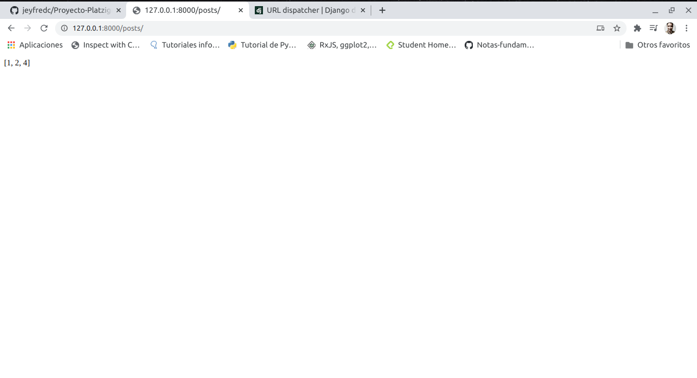

y ahora en **posts/views.py** se va a declarar de manera global un diccionario que contenga un name, user, timestamp y picture y en la funcion se va a pasar como html en el navegador. **Nota:** Esto es a manera de ejemplo.

para poder leer todo el diccionario desempaquetamos con `.format(**post)` y para unir todo utilizamos `.join(content)`

```
"""Post views.  """

# Django
from django.http import HttpResponse
from datetime import datetime

posts=[
    {
        'name': 'Mont Blanck',
        'user': 'Jeyfred Calderon',
        'timestamp' : datetime.now().strftime('%b %dth, %Y - %H:%M hrs'),
        'picture': 'https://picsum.photos/200/200?image=1036',
    },
    {
        'name': 'Via Láctea',
        'user': 'c. vander',
        'timestamp' : datetime.now().strftime('%b %dth, %Y - %H:%M hrs'),
        'picture': 'https://picsum.photos/200/200?image=903',
    },
    {
        'name': 'Nuevo auditorio',
        'user': 'Thespianartist',
        'timestamp' : datetime.now().strftime('%b %dth, %Y - %H:%M hrs'),
        'picture': 'https://picsum.photos/200/200?image=1076',
    }
]


def list_posts(request):
    """ List existing posts. """
    content = []
    for post in posts:
        content.append(""" 
            <p><strong>{name}</strong></p>
            <p><small>{user} - <i>{timestamp}</i></small></p>
            <figure></figure>
         """.format(**post))
    return HttpResponse('<br>'.join(content))

```


## Clase 8 Introducción al template system

Template system de Django es una manera de presentar los datos usando HTML, está inspirado en Jinja2 y su sintaxis, por lo cual comparte muchas similitudes. Permite incluir alguna lógica de programación.

Para comenzar a usar los templates hay que crear un folder dentro de posts y nombrarla **templates**, en este folder crear un archivo que se llame **feed.html** y en este archivo escribimos `Hola, Mundo!`

Ahora dentro de las vistas de posts **posts/views.py** reemplazamos `from django.http import HttpResponse` por `from django.shortcuts import render`, render es una funcion que toma un request, el nombre del template 

**posts/views.py**

```
"""Post views.  """

# Django
from django.shortcuts import render


def list_posts(request):
    """ List existing posts. """
    return render(request, 'feed.html')
```

Verificamos que todo este bien con el servidor en la terminal y recargamos http://127.0.0.1:8000/posts/

para que salga `Hola, Mundo!`

La forma en que trabaja render es que necesita pasar a request para agregar contexto al render, el segundo argumento es el nombre del template que se esta buscando. esto viene predefinido en el archivo de **settings.py**, Donde dice que lo va a encontrar dentro de los directorios de las aplicaciones 

```
TEMPLATES = [
    {
        'BACKEND': 'django.template.backends.django.DjangoTemplates',
        'DIRS': [],
        'APP_DIRS': True, #Busca dentro de los directorios de las aplicaciones 
        'OPTIONS': {
            'context_processors': [
                'django.template.context_processors.debug',
                'django.template.context_processors.request',
                'django.contrib.auth.context_processors.auth',
                'django.contrib.messages.context_processors.messages',
            ],
        },
    },
]
```

la funcion render tambien puede recibir otro argumento como por ejemplo un diccionario que tenga un nombre

```
"""Post views.  """

# Django
from django.shortcuts import render
from datetime import datetime


posts=[
    {
        'title': 'Mont Blanck',
        'user': {
            'name': 'Jeyfred Calderon',
            'picture': 'https://lh3.googleusercontent.com/ogw/ADGmqu9Rq5ukqaEtLja_pDNAyZJq7qMy3YTdwSEEdhXF=s32-c-mo',
        },
        'timestamp' : datetime.now().strftime('%b %dth, %Y - %H:%M hrs'),
        'photo': 'https://picsum.photos/800/600?image=1036',
    },
    {
        'title': 'Via Láctea',
        'user': {
            'name': 'Christian Van der Henst',
            'picture': 'https://picsum.photos/60/60?image=1005',
        },
        'timestamp' : datetime.now().strftime('%b %dth, %Y - %H:%M hrs'),
        'photo': 'https://picsum.photos/800/800?image=903',
    },
    {
        'title': 'Nuevo auditorio',
        'user': {
            'name': 'Uriel (Thespianartist)',
            'picture': 'https://picsum.photos/60/60?image=883',
        },
        'timestamp' : datetime.now().strftime('%b %dth, %Y - %H:%M hrs'),
        'photo': 'https://picsum.photos/500/700?image=1076',
    },
]


def list_posts(request):
    """ List existing posts. """
    return render(request, 'feed.html', {'posts': posts})
```

y cambiar el parametro que recibe **feed.html** por `{{ posts }}`

al recargar el navegador trae lo siguiente pero no es muy util de momento porque no tiene logica de programacion


Ahora si utilizamos el archivo **feed.html** reemplazamos `{{ posts }}` por lo siguiente

```

    <p>{{ post.title }}</p>

```

al recargar el navegador se deben imprimir los titulos

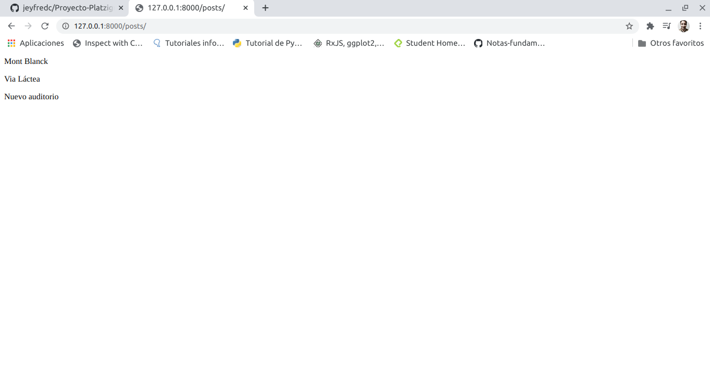

____

A continuacion vamos a utilizar Bootstrap mediante el **CDN** que se encuentra en la pagina de [Booststrap](https://getbootstrap.com/) 

y en el archivo **feed.html** cambiamos la estructura por html5 utilizando Bootstrap

```
<!DOCTYPE html>
<html lang="en">
<head>
    <meta charset="UTF-8">
    <meta name="viewport" content="width=device-width, initial-scale=1.0">
    <title>Platzigram</title>
    <link rel="stylesheet" href="https://stackpath.bootstrapcdn.com/bootstrap/4.5.3/css/bootstrap.min.css" integrity="sha384-TX8t27EcRE3e/ihU7zmQxVncDAy5uIKz4rEkgIXeMed4M0jlfIDPvg6uqKI2xXr2" crossorigin="anonymous">
  	  {# Cargamos la librería #}
        
 
        {# CSS Bootstrap #}
        
</head>
<body>
    <br><br>
    <div class="container">
        <div class="row">
            
            <div class="col-lg-4 offset-lg-4">
                <div class="media">
                    
                    <div class="media-body">
                        <h5 class="mt-0">{{ post.user.name }}</h5>
                        {{ post.timestamp }}
                    </div>
                </div>
                
                <h6 class="ml-1 mt-1">{{ post.title }}</h6>
            </div>
            
        </div>
    </div>
</body>
</html>
```

Por ultimo debemos instalar Bootstrap en este caso la version 4, para eso abrir el archivo **settings.py** y en `INSTALLED_APPS` agregarlo de esta forma

```
INSTALLED_APPS = [
    # Django apps
    'django.contrib.admin',
    'django.contrib.auth',
    'django.contrib.contenttypes',
    'django.contrib.sessions',
    'django.contrib.messages',
    'django.contrib.staticfiles',
    'bootstrap4',

    # Local apps
    'posts',
]
```

en caso que no funcione en la terminal ejecutar `pip install django-bootstrap4`

Correr el servidor y recargar el navegador http://127.0.0.1:8000/posts/ 


## Clase 9 Patrones de diseño y Django

Un patrón de diseño, en términos generales, es una solución reutilizable a un problema común.
El patrón más común para el desarrollo web es MVC (Model, View, Controller) el cual utiliza principalmente PHP y es la manera de separar los datos de la presentacion y de la logica, el Controller es el que maneja la logica de request, sabe que hacer en ese momento y que template debe mostrar. El Controller va a cambiar los datos a traves del modelo y este es el que se encarga de definir la estructura de los datos, el acceso a ellos e incluso la validacion. Finalmente la vista es la que se encarga de ver como presenta los datos al usuario. 

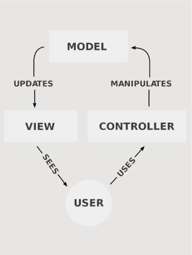

Django implementa un patrón similar llamado MTV (Model, Template, View). Donde el modelo es el que define la estructura de los datos, el Template es la logica de la presentacion de los datos y la vista es la encargada de traer los datos y pasarlos por el template.

## Clase 10 La M en el MTV(model, Template, View)


Para entender mejor esta clase descargar [DB Browser for Sqlite](https://sqlitebrowser.org/dl/)

En el archivo **settings.py** encontramos la condiguracion de la base de datos que trae por default Django el cual es sqlite3 que es un archivo que ya esta presente en el folder de **Platzigram**

```
DATABASES = {
    'default': {
        'ENGINE': 'django.db.backends.sqlite3',
        'NAME': BASE_DIR / 'db.sqlite3',
    }
}
```

El Modelo en Django usa diferentes opciones para conectarse a múltiples bases de datos relacionales, entre las que se encuentran: SQLite, PostgreSQL, Oracle y MySQL.

Para revisarlo como se configura con otra base de datos debemos revisar en la parte de [DATABASES ENGINE](https://docs.djangoproject.com/en/3.1/ref/settings/#databases) especifica el sistema de base de datos con el que vamos a estar trabajando. 

Pero si queremos trabajar con Postgresql o Mysql toca configurar el `HOST` que es la ubicacion de la base de datos donde esta corriendo.

___

Cuando corremos el servidor con `python3 manage.py runserver`


la terminal indica que hay 18 migraciones que no se han aplicado y que el proyecto puede no funcionar correctamente porque las apps que trae por default no han encontrado esa migracion

Ahora si tenemos el servidor encendido apagarlo con `Ctrl + C`

para ejecutar los cambios de las migraciones en la base de datos que viene por defecto, escribir en la terminal 

`python3 manage.py migrate`


y vemos que todo queda OK

Ahora podemos hacer uso de **DB Browser for Sqlite** para abrir el archivo que tenemos en el proyecto

Dar click en Open Database, buscamos el fichero db.sqlite3 del proyecto Platzigram y damos click en abrir

este archivo creo todas las tablas que aparecen en la imagen 


Si se quiere crear una tabla en caso de no usar un Framework como Django lo que habria que hacer es escribir todas las sentencias SQL como las de la imagen para crear esa tabla, y esas sentencias SQL cambian de Engine a Engine, no son las mismas que se usan para Postgresql como las que se usan para Mysql.

Para la creación de tablas, Django usa la técnica del ORM (Object Relational Mapper), una abstracción del manejo de datos usando Programacion Orientada a Objetos, esto es en el caso de Django para trabajar con multiples sistemas como Postgresql, Mysql o oracle a traves de clases de Python.

En definitiva el ORM es un conjunto de clases que permiten interactuar con bases de datos y definir la estructura de tablas.

Como ejempĺo se va a crear un modelo de usuario pero este ya viene con sqlite3.

para crearlo abrir el archivo **posts/models.py**

Para crear un modelo de base de datos como el de la imagen se debe crear una clase, para verificar que los campos que a continuacion se muestran sirven con la base de datos se debe consultar la documentacion que es la [referencia a la base de datos](https://docs.djangoproject.com/en/3.1/ref/models/fields/)

```
""" posts models. """

#Django
from django.db import models


class User(models.Model):
    """ User model. """

    email = models.EmailField()
    password = models.CharField()

    first_name = models.CharField()
    last_name = models.CharField()

    bio = models.TextField()

    birthdate = models.DateField()

    created =  models.DateTimeField()
    modified = models.DateTimeField()
```

Si a continuacion de guardar esto se corre el servidor, nos va a informar que esta faltando

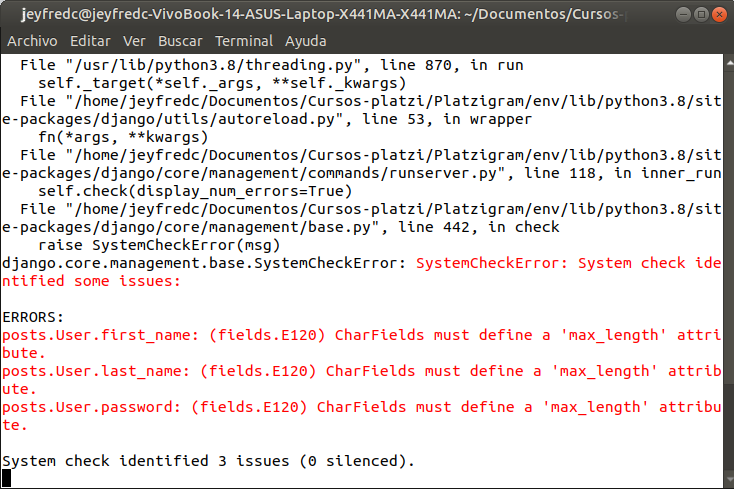

Donde indica que se necesecita tener una maxima longitud para los campos first_name, last_name y password

Terminando de configurar la base de datos se agrega lo siguiente

```
""" posts models. """

#Django
from django.db import models


class User(models.Model):
    """ User model. """

    email = models.EmailField(unique=True)
    password = models.CharField(max_length=100)

    first_name = models.CharField(max_length=100)
    last_name = models.CharField(max_length=100)

    bio = models.TextField(blank=True)

    birthdate = models.DateField(blank=True, null=True)

    created =  models.DateTimeField(auto_now_add=True)
    modified = models.DateTimeField(auto_now=True)
```

- **(max_length=100)** son campos que contienen una maxima longitud

- **(unique=True)** es un campo para que el email como en el ejemplo sea unico

- **(blank=True, null=True)** En el ejemplo depronto la fecha de cumpleaños puede no ser necesaria por tanto se pone en blanco pero por ser un campo numerico se debe configurar como nulo 

- **(auto_now_add=True)** Este sirve para cargar una fecha de creacion de dato en la tabla

- **(auto_now=True)** Este sirve para cargar una fecha de actualizacion de dato en la tabla

Si nuevamente se revisa el servidor despues de haber agregado estos campos ya no debe indicar ningun tipo de error.

Para que tanto DB Browser for sqlite y Django detecten el cambio o modificacion que se hizo en **posts/models.py** 

debemos apagar el servidor nuevamente y ahora usar la sentencia

`python3 manage.py makemigrations`


E indica que se creo un modelo de usuario y realizo unos cambios que se pueden ver en la carpeta **posts/migrations/0001_initial.py**

el archivo es otra clase de Python que indica que fue lo que se creo 


Si se ejecuta el servidor nuevamente va indicar que esta pendiente 1 migracion 


Por tanto nuevamente se debe ejecutar

`python3 manage.py migrate`

`python3 manage.py runserver`

para ver que los cambios estan aplicados se puede abrir DB Browser for sqlite y abrir nuevamente el proyecto, donde debe aparecer una tabla llamada **posts_user**


## Clase 11 El ORM de Django

A continuacion vamos a ver como insertar datos, hacer consultas y hacer filtros en la base de datos.

Antes de continuar se va a agregar un campo mas a la tabla que va a ser una validacion

**Nota:** Django agrega un id a la tabla por defecto es por esto que no es necesario configurarlo en models

Abrir **posts/models.py** y debajo de last_name agregar lo siguiente `is_admin = models.BooleanField(default=False)` este campo es para cualquier usuario no tenga permiso como administrador.

Al agregar este campo hay que indicarle a Django que la base de datos a cambiado.

Nuevamente se debe apagar el servidor si esta encendido y ejecutar

`python3 manage.py makemigrations`

luego 

`python3 manage.py migrate`

y por ultimo si encender el servidor

`python3 manage.py runserver`

tambien se puede verificar que el campo de haya actualizado en DB Browser for sqlite y ademas al agregar este nuevo campo la terminal nos indica que creo un nuevo archivo en **posts/migrations/0002_user_is_admin.py**

___

Para grabar datos en el ORM se debe abrir el shell de python3 pero por si solo no funciona al ejecutarlo. Por tanto en la terminal se debe ejecutar la siguiente sentencia

`python3 manage.py shell`

utilizando `from posts.models import User` podemos hacer la instancia de un objeto en la base de datos. Por ejempĺo crear un usuario asi

```
pepito = User.objects.create(
    email='pepitocarepepito@gmail.com',
    password='pepito1234',
    first_name='pepito',
    last_name='carepepito'
)
```

De esta forma es como se crearia un usuario en la tabla User

se puede consultar la propiedad de la clase a traves de sus valores como por ejemplo

`pepito.email` = email

`pepito.id` = id por defecto

`pepito.pk` = llave primaria por defecto

`pepito.firs_tname` = name


y la otra para confirmar que ya se encuentra en la base de datos es abriendo DB Browser for Sqlite

Seleccionando **Browse Data** y ubicando **Table:** en **post_user**

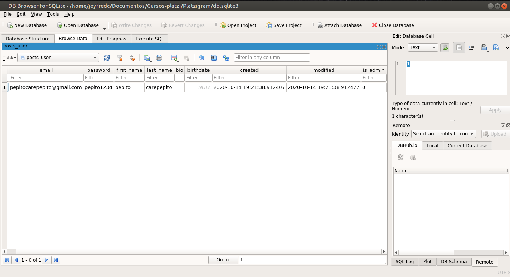

si por ejemplo el email quedo con el correo mal configurado para modificarlo se abre nuevamente shell y se ejecuta lo siguiente

`pepito.email = 'pepito@gmail.com'`

`pepito.save()`

Al actualizar DB Browser ya debe aparecer el correo corregido 


Otra manera de agregar datos a la tabla es instanciar como una clase 

`gonzalo = User()`

`gonzalo.email = 'gonzalo@gmail.com'`

`gonzalo.first_name = 'Gonzalo'`

`gonzalo.last_name = 'Gonzalez'`

`gonzalo.password = 'gongon123'`

`gonzalo.is_admin = True`

`gonzalo.save()`

al finalizar la sentencia con `save()` se guardan los datos en la tabla 

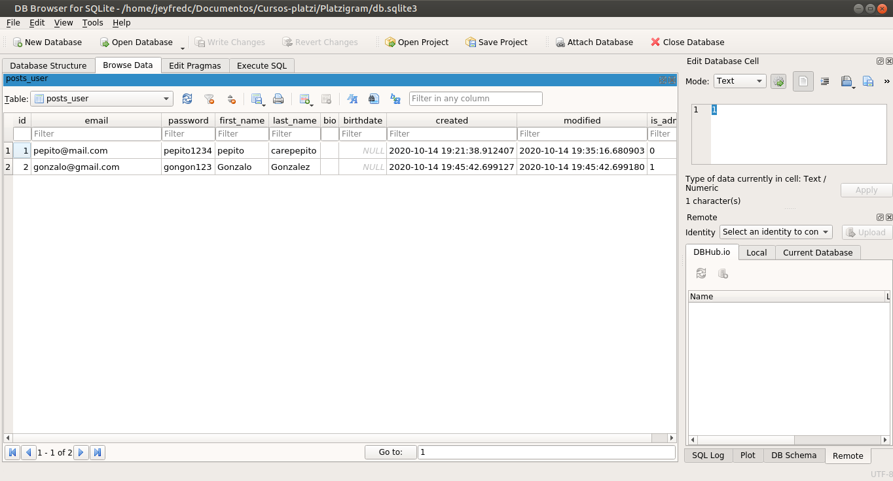

En caso de querer borrar un usuario de la tabla ejecutar en shell

`gonzalo.delete()`

saldra la siguiente respuesta que es la confirmacion que se elimino el usuario en la base de datos y nuevamente se puede consultar en Db Browser

`(1, {'posts.User': 1})`


Para hacer mas facil la creacion de datos a continuacion se dejan 4 usuarios mas para crear, esto se puede realizar en algun archivo y luego pegar en el shell

```
from datetime import date 

users = [
    {
        'email': 'reyes_k423@gmail.com',
        'first_name': 'Camilo',
        'last_name': 'Reyes',
        'password' : '1234567',
        'is_admin': True
    },
    {
        'email': 'mariadb@gmail.com',
        'first_name': 'Maria',
        'last_name': 'Dionisia Benabidez',
        'password' : '5556655'
    },
    {
        'email': 'pablo.barato@hotmail.com',
        'first_name': 'Pablo',
        'last_name': 'Barato',
        'password' : '12345',
        'birthdate' : date(1990, 12, 19),
        'bio' : "Lorem Ipsum is simply dummy text of the printing and typesetting industry. Lorem Ipsum has been the industry's standard dummy text ever since the 1500s"
    },
    {
        'email': 'Ana_de_platzi@gmail.com',
        'first_name': 'Ana',
        'last_name': 'de_platzi',
        'password' : 'computer',
        'is_admin': True,
        'birthdate' : date(1981, 4, 10)
    }
]

from posts.models import User

for user in users:
    obj = User(**user)
    obj.save()
    print(obj.pk)
```


___

Para hacer querys o consultas se puede hacer uso de la [documentacion](https://docs.djangoproject.com/en/3.1/topics/db/queries/)

para traer algun usuario de los creados por ejemplo pablo barato se abre shell y con `get` es posible traer un usuario: 

A continuacion se ejecuta

`from posts.models import User`

`user = User.objects.get(email='pablo.barato@hotmail.com')`

hasta aqui no pasa nada pero si se escribe 

`user`

regresa el id de usuario con el que fue creado pablo el cual seria el numero 5 y lo trae de la siguiente forma

`<User: User object (5)>`

si se pide el tipo de usuario 

`type(user)`

regresa indicando que es una instancia de la clase User

`<class 'posts.models.User'>`

tambien se pueden traer todos los datos

`user.first_name`

`user.last_name`

`user.bio`

`user.password`


___

Todos los usuarios creados hasta el momento fueron configurados con correos gmail a excepcion de pablo que es hotmail para filtrar estos datos se puede hacer uso de `filter` y se ejecuta lo siguiente en shell

**Nota:** la notacion de email**__**, doble guion bajo es para anunciar que se va a realizar un query especial

`gmail_users = User.objects.filter(email__endswith='@gmail.com')`

luego ejecutar 

`gmail_users`

pero esto va a traer los id de los usuarios, en este caso me aparecen 3 porque el correo de pepito no quedo como pepito@gmail.com si no como pepito@mail.com

`<QuerySet [<User: User object (3)>, <User: User object (4)>, <User: User object (6)>]>`


___

para poder traer objetos diferentes al id se puede crear un metodo en el archivo **posts/models.py** despues de la clase y agregar

```
    def __str__(self):
        """ retun self.email """
        return self.email
``` 

Guardar, salir de shell y ejecutar nuevamente shell recordando que lo primero que se hacer es ejecturar

`from posts.models import User`

`gmail_users = User.objects.filter(email__endswith='@gmail.com')`

`gmail_users`

esto va a traer la representacion de los correos como un string


si se requiere traer a todos los usuarios se puede ejecutar

`users = User.objects.all()`

`users`

y esto es lo que traera en shell

`<QuerySet [<User: pepito@mail.com>, <User: reyes_k423@gmail.com>, <User: mariadb@gmail.com>, <User: pablo.barato@hotmail.com>, <User: Ana_de_platzi@gmail.com>]>`

**Nota:** Recordar que **get** es para traer un solo dato y **filter** para traer varios

Tambien se puede filtrar mediante un for si los correos que estan como gmail tiene permisos de administrador o no de la siguiente forma

ejecutar en shell

```
for u in gmail_users:
    print(u.email, ':', u.is_admin)
```

y esto trae 

```
reyes_k423@gmail.com : True
mariadb@gmail.com : False
Ana_de_platzi@gmail.com : True
```
___

Ahora para actualizar que todos los usuarios que tienen correo gmail tienen permisos de administracion se ejecuta en shell lo siguiente

`gmail_users = User.objects.filter(email__endswith='gmail.com').update(is_admin=True)`

**.update** lo que hace es actualizar los datos de todos los correos terminados en **gmail.com**, para verificar se puede consultar en DB Browser, los valores deben estar con el campo con el numero 1


si se quiere que toda la lista de usuarios creados queden con permiso se puede ejecutar lo siguiente

`mail_users = User.objects.filter(email__endswith='mail.com')`

esto trae a todos los que terminen en **mail.com** que serian los 5 usuarios creados hasta el momento

`<QuerySet [<User: pepito@mail.com>, <User: reyes_k423@gmail.com>, <User: mariadb@gmail.com>, <User: pablo.barato@hotmail.com>, <User: Ana_de_platzi@gmail.com>]>`

y luego ejecutar 

`mail_users = User.objects.filter(email__endswith='mail.com').update(is_admin=True)`

consultado en DB Browser, todos los usuarios ahora deberian estar activos

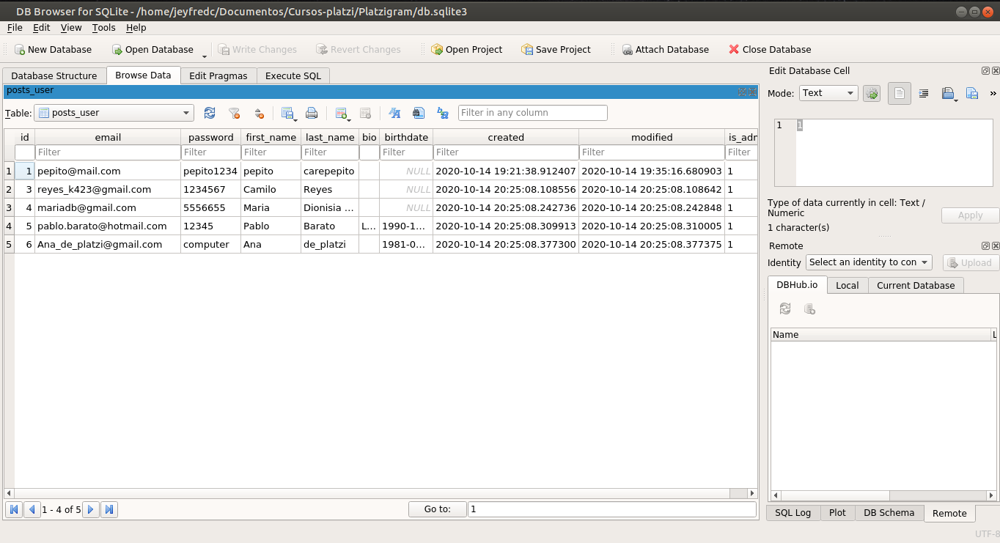

**Reto de la clase:**

Inserta mas usuarios a la base de datos que hemos construido en nuestro entorno de pruebas y realiza consultas en el ORM para traer a los admins.

Crea un nuevo campo PAÍS en el modelo, inserta usuarios y haz filtros.

## Clase 12 Glosario

- **ORM**: Object-relational mapping. Es el encargado de permitir el acceso y control de una base de datos relacional a través de una abstracción a clases y objetos.

- **Templates**: Archivos HTML que permiten la inclusión y ejecución de lógica especial para la presentación de datos.

- **Modelo**: Parte de un proyecto de Django que se encarga de estructurar las tablas y propiedades de la base de datos a través de clases de Python.

- **Vista**: Parte de un proyecto de Django que se encarga de la lógica de negocio y es la conexión entre el template y el modelo.

- **App**: Conjunto de código que se encarga de resolver una parte muy específica del proyecto, contiene sus modelos, vistas, urls, etc.

- **Patrón de diseño**: Solución común a un problema particular.

## Clase 13 Extendiendo el modelo de usuario

El modelo de usuarios que acabamos de construir funciona bien y es válido, sin embargo tiene algunas cosas que podrían representar fallas de seguridad en la aplicación. Por esto vamos a explorar el modelo de usuarios que nos provee Django.

El problema de tener este modelo es que la contraseña esta en texto plano, no existen metodos para verificarla, almacenarla de manera segura, ni tampoco una manera para validar su fortaleza.

Django trae un modelo de usuarios por default la cual se va aextender para utilizar de manera segura

en las bases de datos se ven de esta forma


pero es importante saber que la existencia de esto es gracias a `'django.contrib.auth'` el cual se encuentra en el archivo de **settings.py** en la parte de `INSTALLED APPS` e incluye el modelo de usuario.

Para hacer uso del modelo de usuario se debe ingresar desde shell

para incluirlo se hace de la siguiente forma

`from django.contrib.auth.models import User`

Luego se crea un nuevo usuario, pero este debe recibir como parametro el username y el password

`u = User.objects.create_user(username='gonzalo', password='gonzalez')`

despues de crearlo se puede ver que gonzalo es un usuario

`u`

que tambien tiene un id

`u.pk`

que tiene username

`u.username`

y tambien el valor del password que ya viene encriptado

`u.password`


en DB Browser tambien se puede ver en la tabla **auth_user**


Ahora hay que crear un super usuario en shell

se crea de la siguiente forma:

`python3 manage.py createsuperuser`

a continuacion va a pedir un username, despues un email, el password, confirmacion de password


despues de esto se puede validar en DB Browser.

___

Ahora se va a validar en admin, para eso abrir **urls.py** importar `from django.contrib import admin` y luego agregar el path de admin `path('admin/', admin.site.urls),`

```
""" Platzigram URLs module. """

#Django
from django.contrib import admin
from django.urls import path

from platzigram import views as local_views
from posts import views as posts_views


urlpatterns = [

    path('admin/', admin.site.urls),

    path('hello-world/', local_views.hello_world),
    path('sorted/', local_views.sort_integers),
    path('hi/<str:name>/<int:age>/', local_views.say_hi),
    path('posts/', posts_views.list_posts),
]
```

luego en la consola correr el servidor. verificar que todo este bien y ir al path de admin en http://127.0.0.1:8000/admin/

inmediatamente despues de colocar la ruta se va a abrir el login de admin

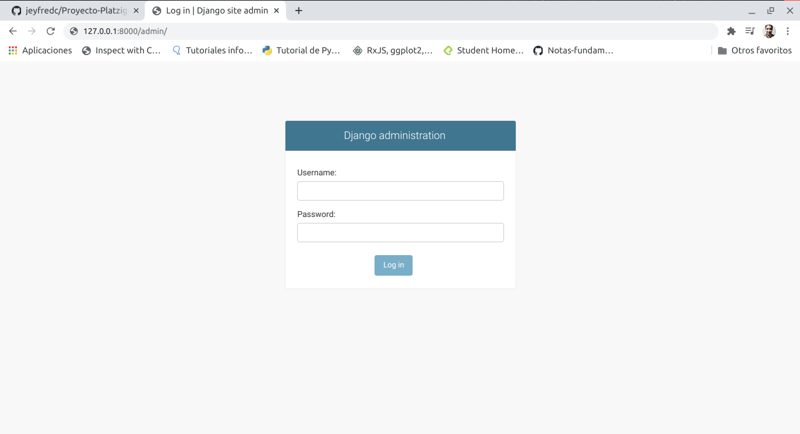

Alli se digita el nombre del super usuario creado con la contraseña asignada 

luego de esto, hay un acceso a grupos y a usuarios al dar click en usuarios esta todo el acceso a los que se han creado hasta el momento


la documentacion de todo esto se puede ver en el repositorio de GitHub de [Django](https://github.com/django/django) y para ver lo que se esta creando ir a la ruta [models](https://github.com/django/django/blob/master/django/contrib/auth/models.py)

___

A continuacion borrar todo el contenido que se encuentr en el archivo **posts/models.py**, sin borrar el archivo **models.py**, no se requiere, ya que se esta haciendo uso de las aplicaciones que provee Django.

Borrar los archivos que se encuentren en **posts/migrations**, sin borrar el archivo **__init__.py**

Borrar tambien el archivo de bases de datos que es **db.sqlite3** 

**Nota:** Todo lo que se borro eran modelos de ejemplo

## Clase 14 Implementación del modelo de usuarios de Platzigram

Las opciones que Django propone para implementar Usuarios personalizados son:

- Usando el Modelo [proxy](https://docs.djangoproject.com/en/3.1/ref/models/fields/)

- Extendiendo la clase abstracta de [Usuario existente](https://docs.djangoproject.com/en/dev/topics/auth/customizing/#extending-the-existing-user-model)

- La opción OneToOneField restringe la posibilidad de tener perfiles duplicados.

Django no guarda archivos de imagen en la base de datos sino la referencia de su ubicación.

para empezar hay que crear una nueva aplicacion llamada users en consola

`python3 manage.py startapp users`

Ahora existe un nuevo folder llamado **users** con los mismos archivos que tenia **posts**

abrir **users/apps.py** para empezar a configurar el proyecto recordando que se debe establecer `verbose_name = 'Users'` el cual debe ir en plural

```
""" User app configuration. """

from django.apps import AppConfig


class UsersConfig(AppConfig):
    """User app config.  """

    name = 'users'
    verbose_name = 'Users'
```

abrir **users/models.py**

segun la documentacion lo que dice es que debe extender el modelo User `from django.contrib.auth.models import User`

el nombre mas indicado para crear el perfil de platzigram seria **Profile** `class Profile(models.Models)`

se hace uso de [OneToOneField](https://docs.djangoproject.com/en/3.1/ref/models/fields/#onetoonefield) 

```
""" Users models. """

#Django
from django.contrib.auth.models import User
from datetime import datetime
from django.db import models


class Profile(models.Models):
    """Profile Model  
    
    Proxy model that extends the base data with other information.
    """

    user = models.OneToOneField(User, on_delete=models.CASCADE)

    website = models.URLField(max_length=200, blank=True)
    biography = models.TextField(blank=True)
    phone_number = models.CharField(max_length=20, blank=True)

    picture = models.ImageField(upload_to='users/pictures', blank=True, null=True)

    created = models.DateField(auto_now_add=True)
    modified = models.DateField(auto_now=True)


def __str__(self):
    """ return username """

    return self.user.username
```

Ahora hay que hacer la instalacion de la aplicacion users en el archivo **settigs.py** en `INSTALLED APPS` y poner debajo de `posts` a `users`

```
INSTALLED_APPS = [
    # Django apps
    'django.contrib.admin',
    'django.contrib.auth',
    'django.contrib.contenttypes',
    'django.contrib.sessions',
    'django.contrib.messages',
    'django.contrib.staticfiles',
    'bootstrap4',

    # Local apps
    'posts',
    'users',
]
```

Como se realiza un cambio en la base de datos hay que hacer la migracion en consola con 

`python3 manage.py makemigrations`

despues ejecutar 

`python3 manage.py migrate`

A continuacion marca este error que indica que o esta instalado Pillow 

```
SystemCheckError: System check identified some issues:

ERRORS:
users.Profile.picture: (fields.E210) Cannot use ImageField because Pillow is not installed.
	HINT: Get Pillow at https://pypi.org/project/Pillow/ or run command "python -m pip install Pillow".
```
(Pillow es una variante (o fork) de la popular librería PIL (Python Image Library) que permite procesar con facilidad imágenes con Python 2. x/3. ... Con Pillow podemos consultar información básica de una imagen como su tamaño, el formato que tiene (jpg, png, gif, etc.), el tipo de imagen (bits/pixel, BN/color, etc.)), la aplicacion obliga a instalar pillow porque en el modelo de bases de datos al crear el objeto `picture` obliga a tener una referencia de imagen el cual trabaja con esta libreria.

para instalar simplemente se ejecuta

`pip install pillow`

Nuevamente ejecutar 

`python3 manage.py makemigrations`

`python3 manage.py migrate`

Nuevamente hay que crear el superusuario porque antes se borro la base de datos

`python3 manage.py createsuperuser`

a continuacion va a pedir un username, despues un email, el password, confirmacion de password


despues de esto se puede validar en DB Browser.

y por ultimo encender el servidor

`python3 manage.py runserver`

verificar si esta ingresando con http://127.0.0.1:8000/admin/

y que la base de datos **users_profile** se encuentre creada


## Clase 15 Explorando el dashboard de administración

Registraremos el perfil que acabamos de customizar, junto con el modelo extendido de Usuario, en el admin de Django para poder manejarlo desde la aplicación.

Esto puede hacerse de dos formas: con admin.site.register(Profile) o creando una nueva clase que herede de Admin.ModelAdmin.

Hasta el momento es posible ingresar a admin pero como tal no hay un perfil de usuario creado 

Abrir el archivo **users/admin.py**

lo primero que hay que hacer es importar Profile `from users.models import Profile` y luego registrar el modelo con `admin.site.register(Profile)`

```
""" User admin classes. """
#Django
from django.contrib import admin

#Models
from users.models import Profile

# Register your models here.
admin.site.register(Profile)
```

Ahora si cargamos el navegador ya aparece Profiles en el admin


Si ahora se selecciona el boton Add se puede crear el perfil de usuario con website, biografia, numero e imagen l dar click en save queda creado el primer perfil


Ahora se va a modificar el registro y crear una clase en el archivo **users/admin.py** que se va a llamar `ProileAdmin`, por convencion siempre se agrega la palabra Admin al final de la clase, para registrarlo en una sola linea se puede hacer a traves de un decorador `@admin.register(Profile)` y 
la clase puede estar vacia

```
""" User admin classes. """
#Django
from django.contrib import admin

#Models
from users.models import Profile


@admin.register(Profile)
class ProfileAdmin(admin.ModelAdmin):
    """ Profile admin. """

    pass
```

con la modificacion realizada, la pagina de momento va a seguir funcionando igual

Al dar  click en Profile los datos del perfil no estan cargando

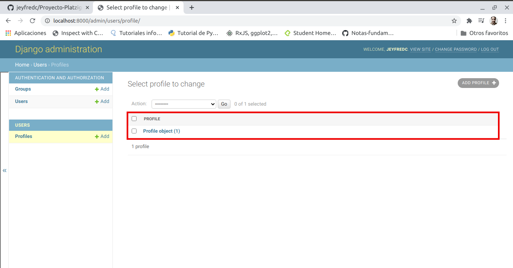

para ordenarlo en la clase `ProfileAdmin` hay que agregar un `list_display` para darle el orden que se requiera

```
""" User admin classes. """
#Django
from django.contrib import admin

#Models
from users.models import Profile


@admin.register(Profile)
class ProfileAdmin(admin.ModelAdmin):
    """ Profile admin. """

    list_display = ('user', 'phone_number', 'website', 'picture')
```    

despues de guardar los cambios con la lista, el perfil se mostrara de la siguiente forma y con el orden que se esta aplicando

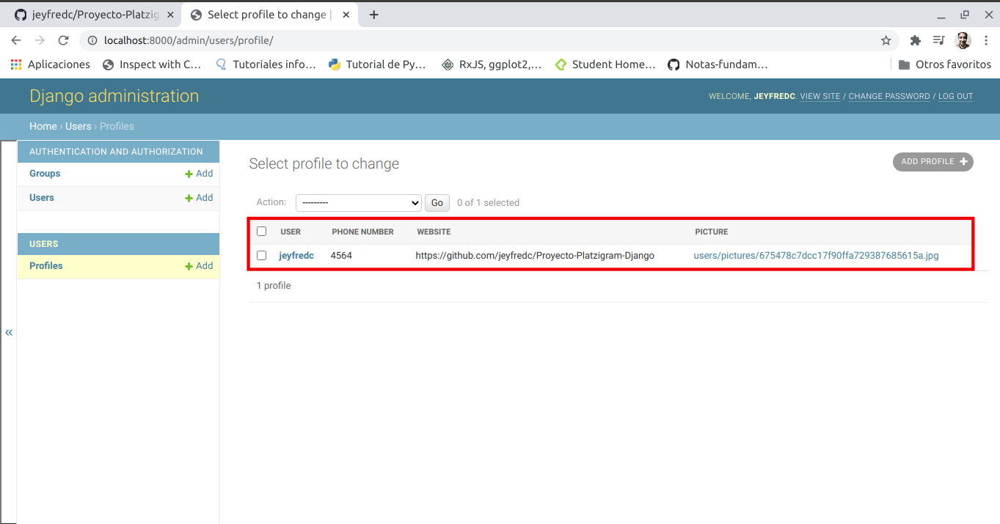

Por el momento solo al dar click al usuario va hacia el detalle del mismo para hacer algun tipo de modificacion

existen otras propiedades para que el numero, el website lo linkee directamente al perfil para hacer alguna modificacion agregando `list_display_links` y seleccionando los objetos que van a adquirir esas propiedades 

```
@admin.register(Profile)
class ProfileAdmin(admin.ModelAdmin):
    """ Profile admin. """

    list_display = ('pk','user', 'phone_number', 'website', 'picture')
    list_display_links = ('pk', 'user', 'phone_number')
```


y tambien existe otra propiedad que permite que se hagan modificaciones directamente desde el perfil

```
@admin.register(Profile)
class ProfileAdmin(admin.ModelAdmin):
    """ Profile admin. """

    list_display = ('pk','user', 'phone_number', 'website', 'picture')
    list_display_links = ('pk', 'user', 'phone_number')
        list_editable =('phone_number', 'website', 'picture')
```

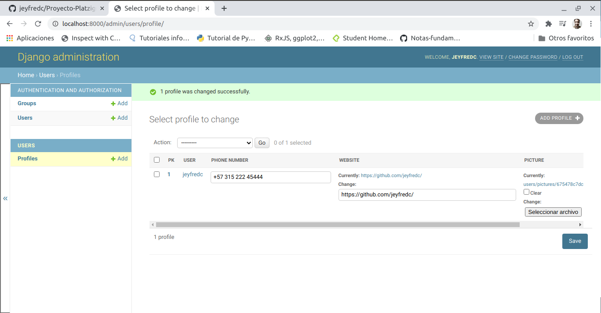

Ahora se puede hacer mas pruebas para crear mas usuarios dando click en **User + Add**

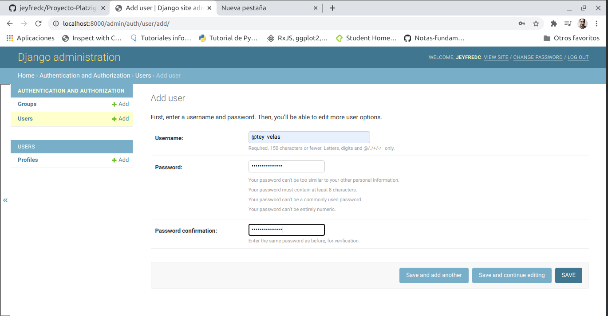

se asigna nombre, apellido y luego se guarda

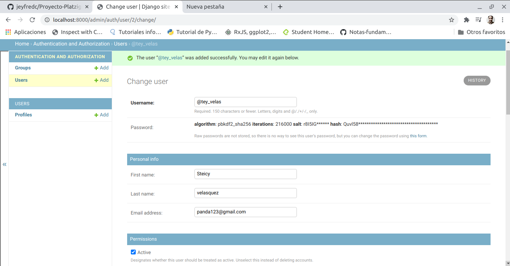

por ultimo seleccionar **Profile + Add** para añadir el perfil 


y luego verificar que esten creado los dos perfiles


Si se quiere agregar una barra de busqueda para hacer mas sencilla la lista cuando existan muchos usuarios existe la propiedad `search_fields`

```
@admin.register(Profile)
class ProfileAdmin(admin.ModelAdmin):
    """ Profile admin. """

    list_display = ('pk','user', 'phone_number', 'website', 'picture')
    list_display_links = ('pk', 'user')
    list_editable = ('phone_number', 'website', 'picture')
    search_fields = ('user__email', 'user__name','user__first_name', 'user__last_name', 'phone_number')
```


tambien se pueden añadir filtros para utilizar mas adelante con la propiedad `list_filter`, estos salen al costado derecho de **Profile**

```
@admin.register(Profile)
class ProfileAdmin(admin.ModelAdmin):
    """ Profile admin. """

    list_display = ('pk','user', 'phone_number', 'website', 'picture')
    list_display_links = ('pk', 'user')
    list_editable = ('phone_number', 'website', 'picture')
    search_fields = ('user__email', 'user__name', 'user__first_name', 'user__last_name', 'phone_number')
    list_filter = ('user__is_active', 'user__is_staff', 'created', 'modified')
```

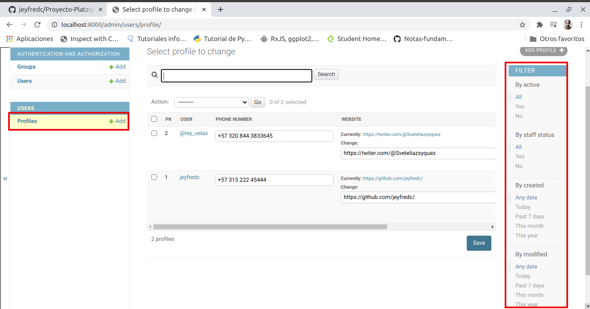

## Clase 16 Dashboard de Administración

Editaremos el detalle para que sea igual de complejo que el detalle de Usuario y le agregaremos los datos del perfil para no tener que estar cambiando de urls. Usaremos fieldsets y admin.StackedInline.

En la documentación de Django, https://docs.djangoproject.com/en/3.1/ref/contrib/admin/ podemos ver cómo funcionan los fieldsets.

Cuando se ingresa a cualquier perfil del administrador se ve la presentacion de la siguiente forma


para cambiar la presentacion del perfil en **users/admin.py** debajo de los `list_filter` se crea el fieldsets el cual sirve para controlar el diseño de la pagina y esta contiene sus configuraciones a traves de tuplas

```
    fieldsets = (
        ('Profile', {
            'fields': (
            ('user', 'picture'),
            ),
        }),
    )
```

Al guardar cambia la forma de la presentacion, por ejemplo solo muestra informacion del usuario  y la imagen


Al agregar mas informacion a la tupla se puede ver que se agrega un campo mas a otra fila donde arroja la informacion del numero y pagina 


```
    fieldsets = (
        ('Profile', {
            'fields': (
            ('user', 'picture'),
            ('phone_number', 'website'),
            ),
        }),
    )
```


Ahora se va a poner otra informacion a traves de otra tupla con lo siguiente

```
    fieldsets = (
        ('Profile', {
            'fields': (('user', 'picture'),),
        }),
        ('Extra info', {
            'fields' : (
                ('website', 'phone_number'),
                ('biography')
            )
        }),
    )
```


A continuacion se va a introducir un campo de metadata pero este no funciona como los otros campos porque no es editable

```
    fieldsets = (
        ('Profile', {
            'fields': (('user', 'picture'),),
        }),
        ('Extra info', {
            'fields' : (
                ('website', 'phone_number'),
                ('biography')
            )
        }),
        ('Metadata', {
            'fields' : (
                ('created', 'modified'),
            )
        }),
    )
```    

Para que esto funcione hay que llamar otra variable llamara `readonlyfields` y quiere decir que todo lo que este dentro de la variable, al acceder al detalle no se va a poder modificar

```
    fieldsets = (
        ('Profile', {
            'fields': (('user', 'picture'),),
        }),
        ('Extra info', {
            'fields' : (
                ('website', 'phone_number'),
                ('biography')
            )
        }),
        ('Metadata', {
            'fields' : (
                ('created', 'modified'),
            )
        }),
    )

    readonly_fields = ('created', 'modified', 'user')
```


Al añadir un usuario hay que dar click en add User y luego pasar a Profiles para crear el perfil del usuario, existe una forma que extiende el modelo de usuario para tener al usuario y al perfil y crearlos en el mismo lugar, la informacion se encuentra en la [documentacion](https://docs.djangoproject.com/en/3.1/topics/auth/customizing/#extending-the-existing-user-model) actualmente la pagina se ve asi 


para realizar el cambio y tener todo en la misma pagina se debe crear una cllase llamada `ProfileInline` y hereda de `admin.StackedInline` y lo unico que recibe como parametro es el modelo, indica que no se puede eliminar y recibe el modelo en plural

`model = Profile`
`can_delete = False`
`verbose_name_plural = 'profiles'`

despues hay que crear la clase `UserAdmin` que hereda de `BaseUserAdmin` para eso hay que importar el modelo `from django.contrib.auth.admin import UserAdmin as BaseUserAdmin` luego se debe registrar `inlines` en una tupla y por ultimo desregistrar al usuario y luego agregar al usuario administador

```
""" User admin classes. """
#Django
from django.contrib.auth.admin import UserAdmin as BaseUserAdmin
from django.contrib import admin
#Models
from django.contrib.auth.models import User
from users.models import Profile


@admin.register(Profile)
class ProfileAdmin(admin.ModelAdmin):
    """ Profile admin. """

    list_display = ('pk','user', 'phone_number', 'website', 'picture')
    list_display_links = ('pk', 'user')
    list_editable = ('phone_number', 'website', 'picture')
    search_fields = ('user__email', 'user__name', 'user__first_name', 'user__last_name', 'phone_number')
    list_filter = ('user__is_active', 'user__is_staff', 'created', 'modified')

    fieldsets = (
        ('Profile', {
            'fields': (('user', 'picture'),),
        }),
        ('Extra info', {
            'fields' : (
                ('website', 'phone_number'),
                ('biography')
            )
        }),
        ('Metadata', {
            'fields' : (
                ('created', 'modified'),
            )
        }),
    )

    readonly_fields = ('created', 'modified', 'user')

class ProfileInline(admin.StackedInline):
    """ Profile in-line admin for users. """

    model = Profile
    can_delete = False
    verbose_name_plural = 'profiles'


# Define a new User admin
class UserAdmin(BaseUserAdmin):
    """ Add profile admin to base user admin. """

    inlines = (ProfileInline,)

# Re-register UserAdmin
admin.site.unregister(User)
admin.site.register(User, UserAdmin)
``` 

y ahora al recargar la pagina no solo se puede crear al usuario si no que de una vez se puede crear tanto usuario como perfil

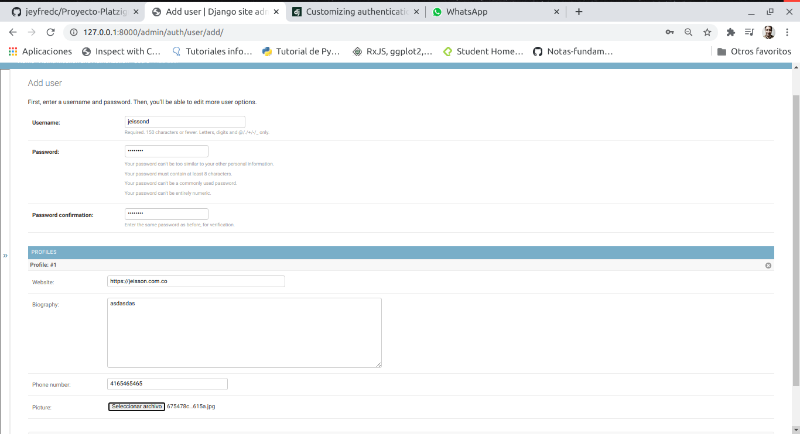

y luego despues de hacer el registro crear el nombre apellido e email


y por ultimo se pueden editar otros campos para que no solo aparezca el username, email, first name, last name  y staff status


y ademas darle un orden sobreescribiendo el `UserAdmin` con `list_display`

```
# Define a new User admin
class UserAdmin(BaseUserAdmin):
    """ Add profile admin to base user admin. """

    inlines = (ProfileInline,)
    list_display = (
        'username',
        'email',
        'first_name', 
        'last_name',
        'is_active',
        'is_staff'
    )

# Re-register UserAdmin
admin.site.unregister(User)
admin.site.register(User, UserAdmin)
```


## Clase 17 Creación del modelo de posts

Para reflejar los cambios en la base de datos, siempre que se crea o se edita un modelo debemos cancelar el server, ejecutar makemigrations, migrate y luego de nuevo volver a correr el servidor con runserver.

Ahora en **posts/models.py** se agrega lo siguiente, importando base de datos y el modelo del usuario

```
# Django
from django.db import models
from django.contrib.auth.models import User


class Post(models.Model):
    """ Post model. """

    user= models.ForeignKey(User, on_delete=models.CASCADE)
    profile = models.ForeignKey('users.Profile', on_delete=models.CASCADE)

    title = models.CharField(max_length=255)
    photo = models.ImageField(upload_to='posts/photos')

    created = models.DateTimeField(auto_now_add=True)
    modified = models.DateTimeField(auto_now=True)


    def __str__(self):
        """ Return title and username. """
        return '{} by @{}'.format(self.title, self.user.username)
```      

Ahora verificar que la base de datos se haya creado la cual se llamas **posts_post**


Con respecto a las imágenes, Django por defecto no está hecho para servir la media, pero editando las urls logramos que se puedan mostrar. Para servir archivos de media, usamos `MEDIA_ROOT` y `MEDIA_URLS`, el cual se encuentra en la [documentacion](https://docs.djangoproject.com/en/3.1/ref/settings/#media-root).

Ahora en el modulo de **urls.py** se debe importar static `from django.conf.urls.static import static` y esto lo que hace es que al final de los `urlpatterns` suma a static y da la url a traves de `settings.MEDIA_URL` y luego la ubicacion de la carpeta `document_root=settings.MEDIA_ROOT`, ademas de esto tambien se debe configurar los settings por lo que hay que importarlo en el archivo con `from django.conf import settings`

```
""" Platzigram URLs module. """

#Django
from django.contrib import admin
from django.conf import settings
from django.conf.urls.static import static
from django.urls import path

from platzigram import views as local_views
from posts import views as posts_views


urlpatterns = [

    path('admin/', admin.site.urls),

    path('hello-world/', local_views.hello_world),
    path('sorted/', local_views.sort_integers),
    path('hi/<str:name>/<int:age>/', local_views.say_hi),
    path('posts/', posts_views.list_posts),
] + static(settings.MEDIA_URL, document_root=settings.MEDIA_ROOT)
```

y ahora hay que realizar la configuracion de los settings en el archivo **settings.py**

debajo de `STATIC_URL`

```
STATIC_URL = '/static/'

MEDIA_ROOT = (BASE_DIR/ 'media')

MEDIA_URL = '/media/'
```

Esto lo que va a hacer es que cuando se corra nuevamente el servidor y se guarde una imagen automaticamente va a crear una carpeta llamada media en Platzigram que es la raiz del proyecto y va a permitir abrir las imagenes cuando en el navegador se seleccione

esta es la ruta que esta configurada antes de incluir el path media

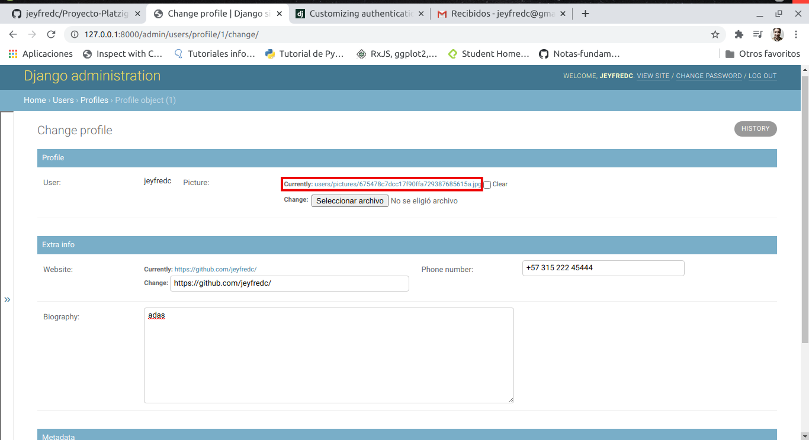

ahora al seleccionar nuevamente una imagen se va a almacenar en **/media/users/pictures/nombredelaimagen**


**Reto de la clase:**

Crea el modelo de posts y regístralo en el admin.

## Clase 18 Templates y archivos estáticos

Los templates quedarán definidos en un nuevo folder que llamaremos /templates/.

despues de crear el folder hay que hacer la configuracion en **settings.py** donde estan los directorios de `TEMPLATES` que es `'DIRS'` y alli indicar que templates va a ser el directorio de estos

```
TEMPLATES = [
    {
        'BACKEND': 'django.template.backends.django.DjangoTemplates',
        'DIRS': [BASE_DIR/ 'templates'],
        'APP_DIRS': True,
        'OPTIONS': {
            'context_processors': [
                'django.template.context_processors.debug',
                'django.template.context_processors.request',
                'django.contrib.auth.context_processors.auth',
                'django.contrib.messages.context_processors.messages',
            ],
        },
    },
]
```

dentro del folder **templates** crear un folder que llame **users** y otro que llame **posts**

en el archivo de las vistas **posts/views.py** reemplazar `return render(request, 'feed.html', {'posts': posts})` por `return render(request, 'posts/feed.html', {'posts': posts})`

y ahora el archivo feed que se encuentra en **posts/templates/feed.html** se mueve a **Platzigram/templates/posts** y se elimina el folder templates de **posts**

y a continuacion en **Platzigram/templates** se crea una vista o modelo base que va a compartir con **posts** y **users** la cual se va a llamar **base.html**

```
<!DOCTYPE html>
<html lang="en">
<head>
    <meta charset="UTF-8">
    


    
    <link rel="stylesheet" href="">
    <link rel="stylesheet" href="https://use.fontawesome.com/releases/v5.1.0/css/all.css" crossorigin="anonymous" />
    <link rel="stylesheet" href="" />

</head>
<body>

    

    <div class="container mt-5">
        
        
    </div>

</body>
</html>
```

Ahora tambien se crea otro archivo que va a ser compartido que es **nav.html**

```

<nav class="navbar navbar-expand-lg fixed-top" id="main-navbar">
    <div class="container">

        <a class="navbar-brand pr-5" style="border-right: 1px solid #efefef;" href="">
            
        </a>

        <div class="collapse navbar-collapse">
            <ul class="navbar-nav mr-auto">

                <li class="nav-item">
                    <a href="">
                        
                    </a>
                </li>

                <li class="nav-item nav-icon">
                    <a href="">
                        <i class="fas fa-plus"></i>
                    </a>
                </li>

                <li class="nav-item nav-icon">
                    <a href="">
                        <i class="fas fa-sign-out-alt"></i>
                    </a>
                </li>

            </ul>
        </div>
    </div>
</nav>
```

dentro de **templates/users** crear otro archivo base que es para los usuarios el cual tambien se llamara **base.html**

```
<!DOCTYPE html>
<html lang="en">
<head>
    

    
    <link rel="stylesheet" href="https://stackpath.bootstrapcdn.com/bootstrap/4.5.3/css/bootstrap.min.css" integrity="sha384-TX8t27EcRE3e/ihU7zmQxVncDAy5uIKz4rEkgIXeMed4M0jlfIDPvg6uqKI2xXr2" crossorigin="anonymous">
</head>
<body class="h-100">

    <div class="container h-100">
        <div class="row-h100 justify-content-center align-items-center">
            <div class="col-sm-12 col-md-5 col-lg-5 pt-2 pl-5 pr-5 pb-5" id="auth-container" >
                

                
                
            </div> 
        </div>
    </div>
    
</body>
</html>
```

Despues de realizar esto verificar que el servidor este corriendo correctamente

ahora lo que se quiere hacer es que **templates/posts/feed.html** herede de **templates/base.html**, **feed.html** queda de la siguiente forma

para que feed pueda heredar se van a eliminar algunas cosas del archivo y mediante la sintaxis `` y luego `` para agregar el titulo o cabecera, todo bloque se debe cerrar con `` despues dentro de `` va todo el contenido que ira en la pagina

```



<title>Platzigram feed</title>



    <div class="row">
        
        <div class="col-lg-4 offset-lg-4">
            <div class="media">
                
                <div class="media-body">
                    <h5 class="mt-0">{{ post.user.name }}</h5>
                    {{ post.timestamp }}
                </div>
            </div>
            
            <h6 class="ml-1 mt-1">{{ post.title }}</h6>
        </div>
        
    </div>

```

Al recargar la pagina http://127.0.0.1:8000/posts/ no se va a ver como antes 

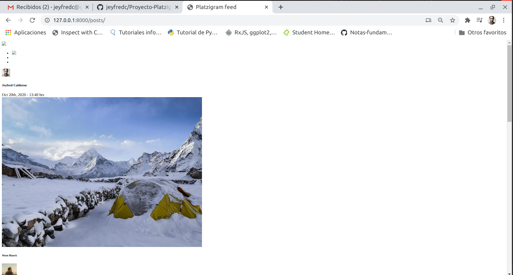

porque hace falta cargar los archivos estaticos que estan en **templates/base.html**

```
    <link rel="stylesheet" href="" />
    <link rel="stylesheet" href="https://use.fontawesome.com/releases/v.5.1.0/css/all.css" crossorigin="anonymous" /> 
    <link rel="stylesheet" href="" /> 
```

El concepto de archivos estáticos en Django, son archivos que se usan a través de la aplicación para pintar los datos. Pueden ser archivos de imagen, audio y video, o archivos css y scripts js.

En el folder Platzigram que es la raiz del proyecto crear un folder que se llame **static** y dentro de static crear otro folder que se llame **css** y otro aparte que se llame **img**

copiar los archivos del repositorio alli en cada una de sus carpetas

Para servir archivos estáticos, nos apoyamos en STATIC_ROOT y STATIC_URLS. el cual encontramos en la [documentacion](https://docs.djangoproject.com/en/3.1/ref/settings/#std:setting-STATICFILES_DIRS)

Abrir **settings.py** y dejar los archivos estaticos de la siguiente forma

```
STATIC_URL = '/static/'

STATICFILES_DIRS = [BASE_DIR/ 'static']

STATICFILES_FINDERS = [
    'django.contrib.staticfiles.finders.FileSystemFinder',
    'django.contrib.staticfiles.finders.AppDirectoriesFinder',
]

MEDIA_ROOT = (BASE_DIR/ 'media')

MEDIA_URL = '/media/'
```

Terminando de configurar el folder static verificar que el servidor este corriendo de manera correcta, apagarlo y nuevamente prenderlo para aplicar cambios y despues recargar la pagina http://127.0.0.1:8000/posts/, se debe ver la presentacion de la siguiente forma, faltando algunas cosas por corregir.

